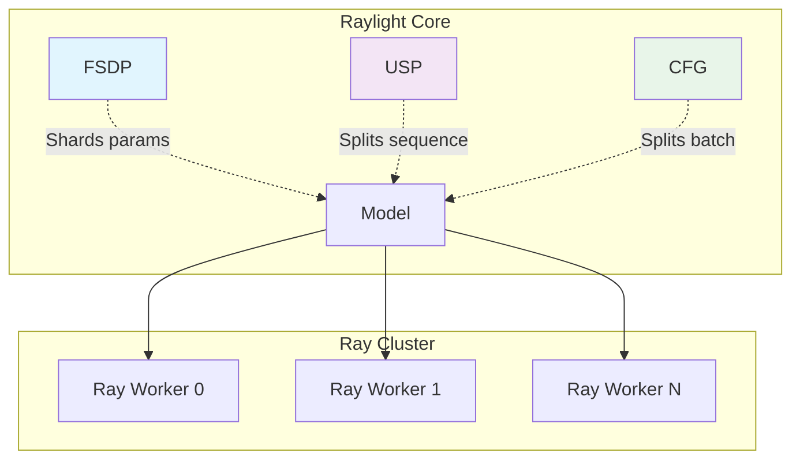
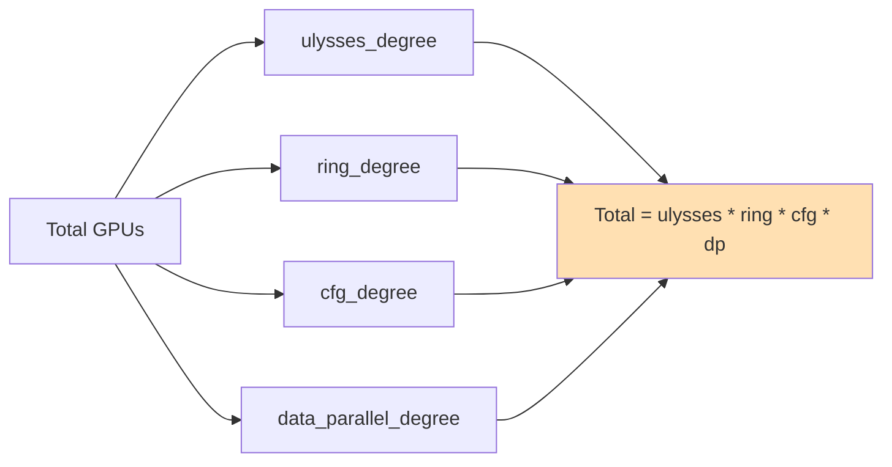
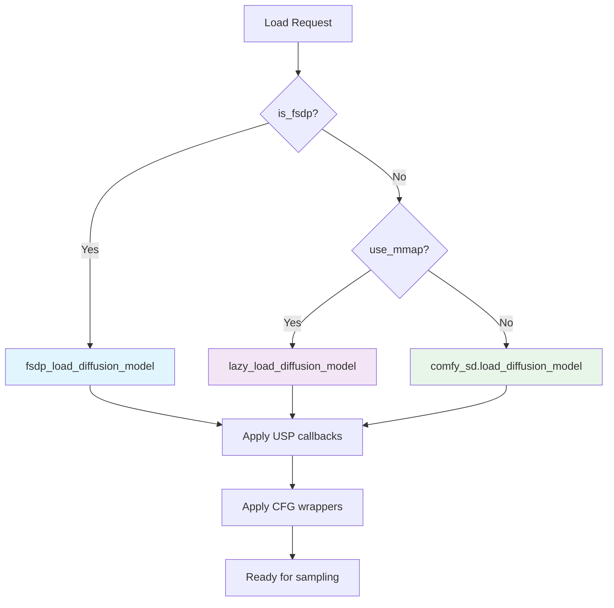

# Raylight Core Architecture

## Overview

Raylight is a distributed inference framework for ComfyUI that enables multi-GPU parallelism through complementary techniques: **FSDP**, **USP**, and **CFG Parallelism**

## Architecture Diagram



**Note**: PipeFusion code exists in the WAN implementation but is not used in Raylight.

## Quick Start

### Basic Configuration

```python
parallel_dict = {
    # FSDP (optional)
    "is_fsdp": False,
    "fsdp_cpu_offload": False,

    # USP/CFG (optional)
    "is_xdit": True,
    "ulysses_degree": 4,
    "ring_degree": 1,
    "cfg_degree": 2,

    # PipeFusion (optional, currently soft disabled)
    "pipefusion_enabled": False,

    # Other
    "use_mmap": True,
}
```

### GPU Requirements



**Example**: WAN21 with USP=4, CFG=2 on 8 GPUs
```
Total GPUs = 4 × 1 × 2 × 1 = 8 GPUs
```

## File Structure

```
custom_nodes/raylight/
├── docs/
│   ├── 1-intro.md              # This file
│   ├── 2-fsdp.md               # FSDP documentation
│   ├── 3-usp.md                # USP documentation
│   ├── 4-cfg.md                # CFG parallelism
│   └── 5-expansion.md          # Expansion modules
├── src/raylight/
│   ├── comfy_dist/
│   │   ├── sd.py               # Model loading (FSDP, GGUF, lazy)
│   │   ├── fsdp_utils.py       # FSDP utilities
│   │   └── lora.py             # Distributed LoRA
│   ├── distributed_modules/
│   │   ├── usp.py              # USP registry
│   │   ├── cfg.py              # CFG registry
│   │   └── attention.py        # xfuser attention factory
│   ├── distributed_worker/
│   │   └── ray_worker.py       # Ray worker implementation
│   └── diffusion_models/
│       ├── utils.py            # Padding utilities
│       ├── flux/               # Flux model parallelism
│       ├── wan/                # WAN model parallelism
│       ├── lightricks/         # LTXV/LTXAV parallelism
│       └── ...                 # Other models
└── expansion/
    ├── comfyui_gguf/           # GGUF model support
    └── comfyui_lazytensors/    # Lazy tensor loading
```

## Documentation Files

1. **[1-intro.md](1-intro.md)** - Overview and quick start (this file)
2. **[2-fsdp.md](2-fsdp.md)** - FSDP documentation
3. **[3-usp.md](3-usp.md)** - USP documentation
4. **[4-cfg.md](4-cfg.md)** - CFG parallelism
5. **[5-expansion.md](5-expansion.md)** - Expansion modules

## Key Concepts

### Registry Pattern

Raylight uses registry patterns for USP and CFG to support multiple models:

```python
# USP registry
@USPInjectRegistry.register(model_base.Flux)
def _inject_flux(model_patcher, base_model, *args):
    # Inject USP for Flux model
    ...

# CFG registry
@CFGParallelInjectRegistry.register(model_base.Flux)
def _inject_flux():
    # Return CFG wrapper for Flux
    return cfg_parallel_forward_wrapper
```

### Model Loading Flow



## Contributing

To add support for a new model:

1. **USP**: Register in `distributed_modules/usp.py` + implement in `diffusion_models/<model>/xdit_context_parallel.py`
2. **CFG**: Register in `distributed_modules/cfg.py` + implement in `diffusion_models/<model>/xdit_cfg_parallel.py`
3. **FSDP**: Usually works automatically via `fsdp_load_diffusion_model()`

See individual documentation files for detailed implementation guides.

---

*Last updated: 2026-04-11*
