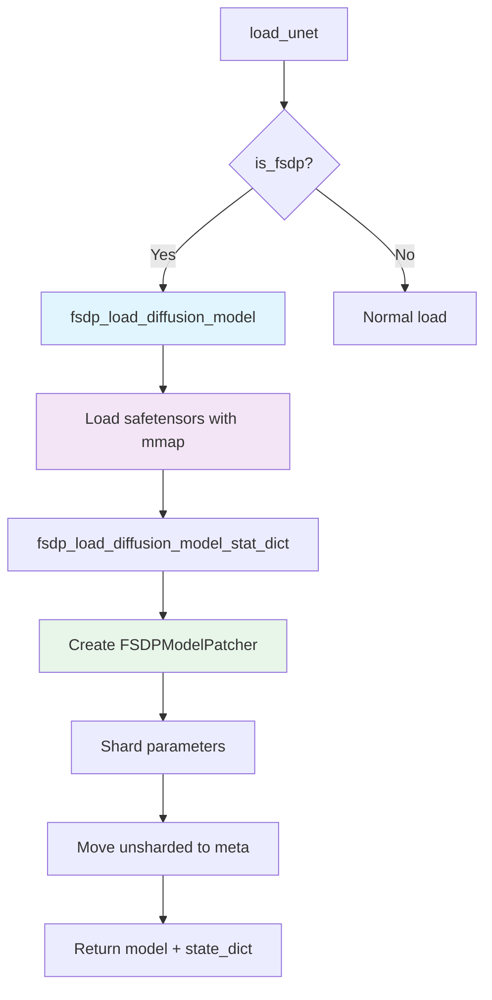

# FSDP (Fully Sharded Data Parallel)

## Overview

FSDP shards model parameters across GPUs, enabling loading of models larger than single-GPU memory. Parameters are distributed with each GPU storing only a shard. Raylight use new FSDP2 API which use DTensor. FSDP2 in ComfyUI is uncharted territory, since most of the FSDP application is in training unlike the dynamic nature of ComfyUI (load, unload, reload model)


## How It Works

### Bottom-Up Sharding

Raylight uses a bottom-up approach to determine FSDP2 sharding hierarchy, based on [TorchTune](https://github.com/meta-pytorch/torchtune/blob/41aaca463e3894de83d7f8ea5fe01b15de78c5a0/torchtune/training/_distributed.py#L336):

```
model                          [FSDP]
├── block0                     [FSDP]
│   ├── qkv                    [FSDP, ignored_params={q.scale,k.scale,v.scale}]
│   │   ├── q.weight           [SHARDED]
│   │   ├── q.scale            [IGNORED]
│   │   ├── k.weight           [SHARDED]
│   │   ├── k.scale            [IGNORED]
│   │   ├── v.weight           [SHARDED]
│   │   └── v.scale            [IGNORED]
│   ├── ffn                    [FSDP, ignored_params={scale}]
│   │   ├── weight             [SHARDED]
│   │   └── scale              [IGNORED]
│   └── conv                   [FSDP, ignored_params={} ]
│       ├── weight             [SHARDED]
│       └── bias               [SHARDED]
```

## Configuration

### Basic FSDP

```python
parallel_dict = {
    "is_fsdp": True,
    "fsdp_cpu_offload": False,  # Optional: offload to CPU when not in use
    "use_mmap": True,           # Optional: memory-map safetensors
}
```

### FSDP with CPU Offload

```python
parallel_dict = {
    "is_fsdp": True,
    "fsdp_cpu_offload": True,   # Offload to CPU when not computing
    "use_mmap": True,
}
```

## Loading Flow



## Key Functions

### `fsdp_load_diffusion_model()`

**Location**: `comfy_dist/sd.py:193-205`

```python
def fsdp_load_diffusion_model(
    unet_path,
    rank,
    device_mesh,
    is_cpu_offload,
    model_options={}
):
    """
    Load diffusion model with FSDP sharding.

    Args:
        unet_path: Path to model file
        rank: GPU rank (0 to world_size-1)
        device_mesh: torch.device_mesh for sharding
        is_cpu_offload: Whether to offload to CPU
        model_options: Additional options (use_mmap, dtype, etc.)

    Returns:
        (model_patcher, state_dict)
    """
```

### `fsdp_load_diffusion_model_stat_dict()`

**Location**: `comfy_dist/sd.py:526-604`

```python
def fsdp_load_diffusion_model_stat_dict(
    sd, rank, device_mesh, is_cpu_offload, model_options={}, metadata=None
):
    """
    Load state dict with FSDP sharding.

    This function:
    1. Detects model type from state dict
    2. Creates model config
    3. Creates FSDPModelPatcher
    4. Shards parameters across GPUs
    5. Returns model and state dict for synchronization
    """
```

### `collect_bottom_up_shard_order()`

**Location**: `comfy_dist/fsdp_utils.py:130-142`

```python
def collect_bottom_up_shard_order(model):
    """
    Determines FSDP sharding hierarchy from leaves to root.

    Returns:
        List of (module_path, module) tuples in bottom-up order
    """
```

## Usage in Ray Worker

### Loading FSDP Model

**Location**: `distributed_worker/ray_worker.py:314-355`

```python
def load_unet(self, unet_path, model_options):
    if self.parallel_dict["is_fsdp"] is True:
        # Monkey patch for FSDP
        import comfy.model_patcher as model_patcher
        import comfy.model_management as model_management

        from raylight.comfy_dist.model_management import cleanup_models_gc
        from raylight.comfy_dist.model_patcher import LowVramPatch

        from raylight.comfy_dist.sd import fsdp_load_diffusion_model

        fsdp_model_options = dict(model_options)
        fsdp_model_options["use_mmap"] = self.parallel_dict.get("use_mmap", True)

        # Apply monkey patches
        model_patcher.LowVramPatch = LowVramPatch
        model_management.cleanup_models_gc = cleanup_models_gc

        # Load model with FSDP
        self.model, self.state_dict = fsdp_load_diffusion_model(
            unet_path,
            self.local_rank,
            self.device_mesh,
            self.is_cpu_offload,
            model_options=fsdp_model_options,
        )
```

### Applying FSDP to Model

**Location**: `distributed_worker/ray_worker.py:130-137`

```python
def set_meta_model(self, model):
    """Set meta model and apply FSDP sharding."""
    first_param_device = next(model.model.parameters()).device
    if first_param_device == torch.device("meta"):
        self.state_dict = None
        self.model = model
        self.model.config_fsdp(self.local_rank, self.device_mesh)
    else:
        raise ValueError("Model being set is not meta, can cause OOM in large model")
```

## Limitations

### GGUF FSDP

GGUF models are **not supported** with FSDP. However I already implemented the code inside the kitchen patch folder:

```python
# ray_worker.py:427-429
if self.parallel_dict["is_fsdp"] is True:
    # GGUF FSDP stays disabled for now.
    raise RuntimeError("FSDP on GGUF is not supported")
```

**Reason**: GGUF loader doesn't support FSDP sharding at the loader level.

```

## Quantized Models

FSDP supports quantized models via `QuantizedTensor`:

```python
# comfy_dist/fsdp_utils.py:55-62
def freeze_and_detect_qt(model):
    has_qt = False
    for param in model.parameters():
        param.requires_grad = False
        local = getattr(param, "_local_tensor", None)
        if isinstance(param, QuantizedTensor) or isinstance(local, QuantizedTensor):
            has_qt = True
    return has_qt
```


## Troubleshooting

### "Model param device is not meta"

**Cause**: Model already loaded on GPU before FSDP sharding

**Solution**: Ensure meta model is passed to `set_meta_model()`

### "FSDP sharding failed"

**Cause**: Model has weird layer types

**Solution**: Check `fsdp_utils.py`

### "CUDA out of memory"

**Cause**: FSDP overhead + activation memory > GPU memory

**Solution**: Enable CPU offload:
```python
parallel_dict["fsdp_cpu_offload"] = True
```

## See Also

- **[1-intro.md](1-intro.md)** - Overview
- **[3-usp.md](3-usp.md)** - USP parallelism
- **[4-cfg.md](4-cfg.md)** - CFG parallelism

---

*Last updated: 2026-04-11*

