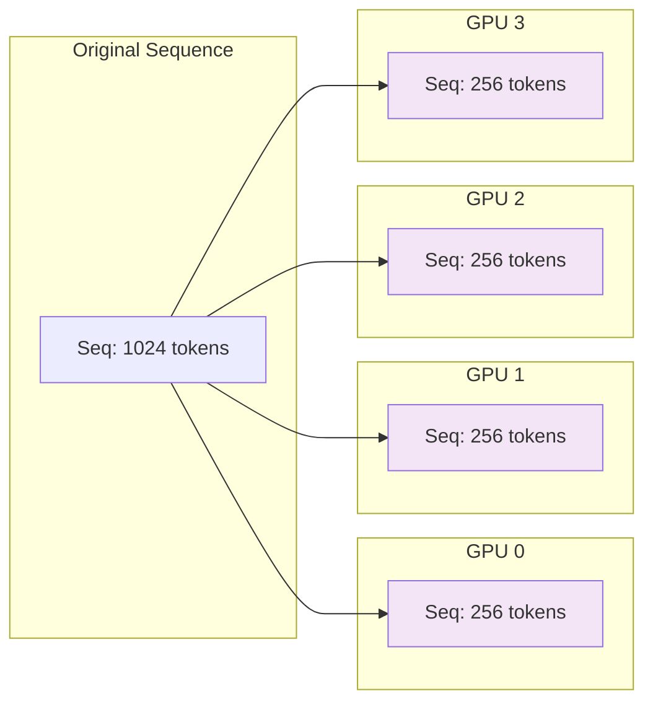
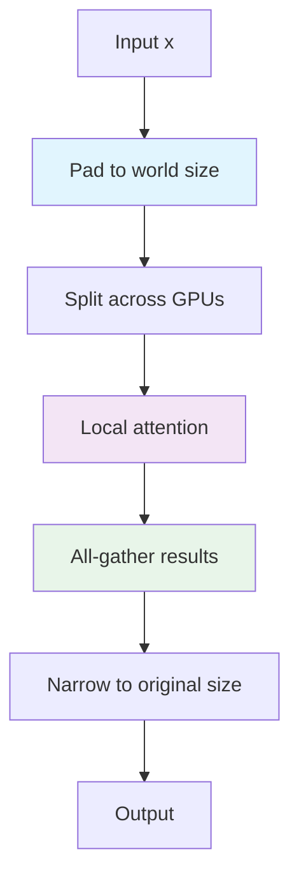
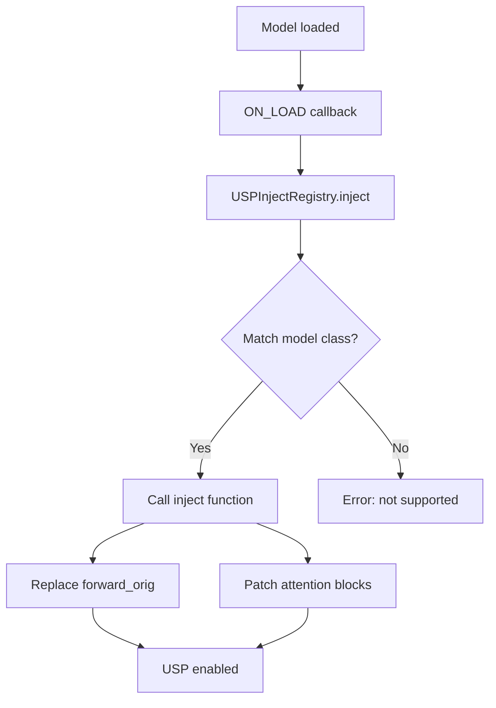

# USP (Ulysses Sequence Parallelism)

## Overview

USP splits the sequence dimension (tokens, pixels, frames) across GPUs, reducing memory per GPU and enabling longer sequences. It uses **Ulysses attention** from xFuser for parallel attention computation.

## When to Use

- Long sequences (high resolution, long videos)
- Want to parallelize attention computation
- Multi-GPU setup with fast interconnect (NVLink)
- Memory-bound attention layers

## How It Works

### Sequence Splitting



### Flow Diagram



### Key Steps

1. **Pad**: Pad sequence to be divisible by world size
2. **Split**: Chunk sequence across GPUs
3. **Process**: Each GPU processes its local chunk
4. **Gather**: All-gather results from all GPUs
5. **Narrow**: Trim to original sequence length

## Configuration

### Basic USP

```python
parallel_dict = {
    "is_xdit": True,
    "ulysses_degree": 4,  # Split sequence across 4 GPUs
    "ring_degree": 1,     # Ring attention (optional, for large clusters)
    "cfg_degree": 1,      # Keep CFG on single GPU
    "attention": "xdit",  # Use xfuser attention
    "sync_ulysses": True, # Sync after ulysses attention
}
```

### USP with Ring Attention

For very large clusters:

```python
parallel_dict = {
    "is_xdit": True,
    "ulysses_degree": 2,
    "ring_degree": 4,     # Ring attention across 4 GPUs
    "cfg_degree": 1,
    "attention": "xdit",
    "sync_ulysses": True,
}
```

**Total sequence parallel degree**: `ulysses × ring = 2 × 4 = 8`

## Registry Pattern

### USP Inject Registry

**Location**: `distributed_modules/usp.py:5-33`

```python
class USPInjectRegistry:
    """Registry for registering and applying USP context parallelism injections."""

    _REGISTRY = {}

    @classmethod
    def register(cls, model_class):
        """Register a model class and its USP injection handler."""
        def decorator(inject_func):
            cls._REGISTRY[model_class] = inject_func
            return inject_func
        return decorator

    @classmethod
    def inject(cls, model_patcher, base_model, *args):
        """Inject USP for matched model class."""
        for registered_cls, inject_func in cls._REGISTRY.items():
            if isinstance(base_model, registered_cls):
                print(f"[USP] Initializing USP for {registered_cls.__name__}")
                return inject_func(model_patcher, base_model, *args)
        raise ValueError(f"Model: {type(base_model).__name__} is not yet supported for USP Parallelism")
```

### Registering a Model

**Location**: `distributed_modules/usp.py:250-261`

```python
if hasattr(model_base, "Flux"):
    @USPInjectRegistry.register(model_base.Flux)
    def _inject_flux(model_patcher, base_model, *args):
        from ..diffusion_models.flux.xdit_context_parallel import (
            usp_dit_forward,
            usp_single_stream_forward,
            usp_double_stream_forward,
        )

        model = base_model.diffusion_model
        for block in model.double_blocks:
            block.forward = types.MethodType(usp_double_stream_forward, block)
        for block in model.single_blocks:
            block.forward = types.MethodType(usp_single_stream_forward, block)
        model.forward_orig = types.MethodType(usp_dit_forward, model)
```

## Model-Specific Implementations

### Flux (MMDiT-style)

**Location**: `diffusion_models/flux/xdit_context_parallel.py`

Flux uses MMDiT architecture with separate image and text streams:

```python
def usp_dit_forward(
    self,
    img: Tensor,
    img_ids: Tensor,
    txt: Tensor,
    txt_ids: Tensor,
    timesteps: Tensor,
    y: Tensor,
    guidance: Tensor = None,
    ...
):
    # Pad and split image and text sequences
    img, img_orig = pad_group_to_world_size(img, dim=1)
    txt, txt_orig = pad_group_to_world_size(txt, dim=1)

    # Split positional embeddings
    img_ids = sp_chunk_group(img_ids, sp_world_size, sp_rank, dim=1)
    txt_ids = sp_chunk_group(txt_ids, sp_world_size, sp_rank, dim=1)

    # Process with local blocks
    # ...

    # Gather and narrow
    img = sp_gather_group(img, img_orig, dim=1)
    txt = sp_gather_group(txt, txt_orig, dim=1)
```

### WAN21 (Non-MMDiT)

**Location**: `diffusion_models/wan/xdit_context_parallel.py`

WAN21 uses a different pattern - splits latent + positional embeddings:

```python
def usp_dit_forward(
    self,
    x,
    t,
    context,
    clip_fea=None,
    freqs=None,
    ...
):
    # Pad and split
    x, orig_size = _pad_and_split_for_sp(x, dim=1)
    freqs, _ = _pad_and_split_for_sp(freqs, dim=1)

    # Process
    # ...

    # Gather
    x = get_sp_group().all_gather(x.contiguous(), dim=1)
    x = x[:, :orig_size, :]
```

### LTXV/LTXAV (Lightricks)

**Location**: `diffusion_models/lightricks/xdit_context_parallel.py`

Lightricks models have special handling for audio/video:

```python
def usp_dit_forward(
    self, x, timestep, context, attention_mask, frame_rate=25, ...
):
    # Split x (latent), context (text), and PE
    x, x_orig = pad_group_to_world_size(x, dim=1)
    context, _ = pad_group_to_world_size(context, dim=1)
    pe = pad_and_split_pe(pe, dim=2, sp_world_size=sp_world_size, sp_rank=sp_rank)

    # Chunk and process
    x = sp_chunk_group(x, sp_world_size, sp_rank, dim=1)
    context = sp_chunk_group(context, sp_world_size, sp_rank, dim=1)

    # ...
```

## Attention Replacement

### xfuser Attention Factory

**Location**: `distributed_modules/attention.py`

Raylight replaces upstream `optimized_attention` with xfuser attention:

```python
def make_xfuser_attention(attn_type, sync_ulysses):
    """Create xfuser attention wrapper."""
    if attn_type == "xdit":
        xfuser_attn = import_xfuser_attention()
        return xfuser_attn.make_xfuser_attention(attn_type, sync_ulysses)
```

DO NOT playing arround with `attention_mask`. On xfuser_attn parent function it is not used.

### Block-Level Patching

For models with block-level attention, Raylight patches attention forward methods:

```python
# Example from Flux
for block in model.double_blocks:
    block.forward = types.MethodType(usp_double_stream_forward, block)

# Example from LTXV
for block in model.transformer_blocks:
    block.attn1.forward = types.MethodType(usp_cross_attn_forward, block.attn1)
    block.attn2.forward = types.MethodType(usp_cross_attn_forward, block.attn2)
```

## Usage in Ray Worker

### Patching USP

**Location**: `distributed_worker/ray_worker.py:236-240`

```python
def patch_usp(self):
    """Add USP callbacks for sequence parallelism."""
    self.model.add_callback(
        pe.CallbacksMP.ON_LOAD,
        USPInjectRegistry.inject,
    )
```

### When USP is Applied

USP is applied during model loading via the `ON_LOAD` callback:



## Performance Considerations

### Memory Savings

With USP, activation memory is reduced proportionally to sequence parallel degree:

```
Memory_per_GPU ≈ (Model_Params × Activation_Factor) / SP_Degree + Overhead
```

**Example**: WAN21 with SP=4
```
Memory_per_GPU ≈ (Base_Memory / 4) + 2GB overhead
```

### Communication Overhead

USP requires all-gather after attention:
- **Ulysses**: All-gather across ulysses group
- **Ring**: Ring all-reduce across ring group

**Recommendation**: Use fast interconnect (NVLink, InfiniBand) for best performance.


## See Also

- **[1-intro.md](1-intro.md)** - Overview
- **[2-fsdp.md](2-fsdp.md)** - FSDP parallelism
- **[4-cfg.md](4-cfg.md)** - CFG parallelism

---

*Last updated: 2026-04-11*
