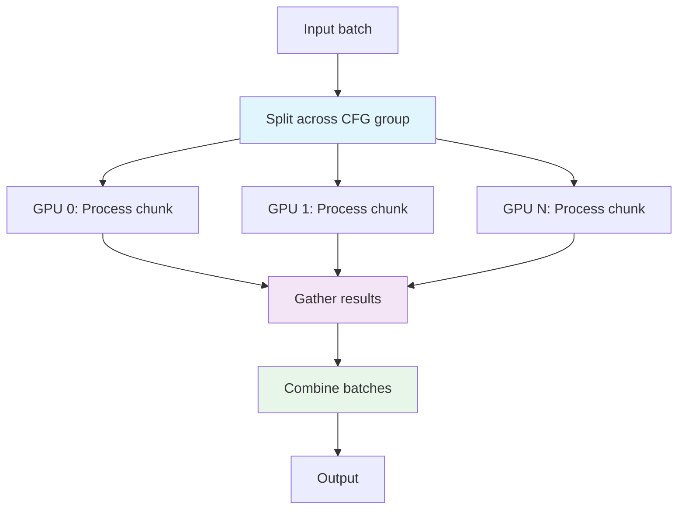
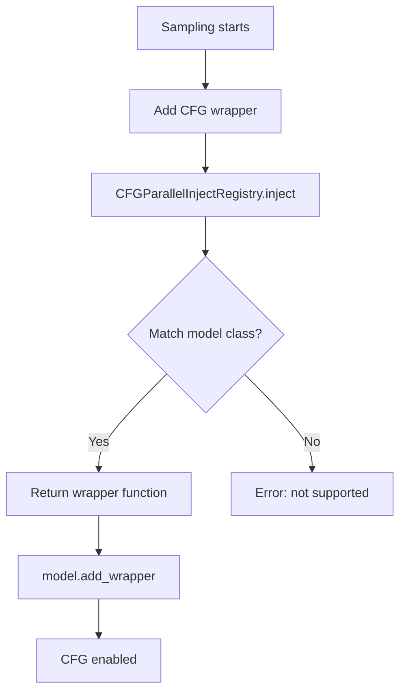

# CFG Parallelism

## Overview

CFG (Classifier-Free Guidance) parallelism splits the CFG batch across GPUs. Instead of computing positive and negative prompts on a single GPU, each GPU handles a portion of the batch, reducing memory and computation.
Basically it target the batch dim, usually the model is processing `x`, where `x = [batch, Sequence, Head, N_Head]`

## How It Works

### Flow Diagram



### Key Steps

1. **Chunk**: Split batch across CFG group
2. **Process**: Each GPU processes its chunk independently
3. **Gather**: Collect results from all GPUs
4. **Combine**: Merge batches back together

## Configuration

### Basic CFG

```python
parallel_dict = {
    "is_xdit": True,
    "ulysses_degree": 1,  # No sequence parallel
    "ring_degree": 1,
    "cfg_degree": 2,      # Split CFG across 2 GPUs
}
```

### CFG with USP

Combine CFG and USP for maximum parallelism:

```python
parallel_dict = {
    "is_xdit": True,
    "ulysses_degree": 4,  # USP across 4 GPUs
    "ring_degree": 1,
    "cfg_degree": 2,      # CFG across 2 GPUs
}
```

**Total GPUs needed**: `ulysses × cfg = 4 × 2 = 8 GPUs`

## Registry Pattern

### CFG Inject Registry

**Location**: `distributed_modules/cfg.py:4-32`

```python
class CFGParallelInjectRegistry:
    """Registry for registering and applying CFG context parallelism injections."""

    _REGISTRY = {}

    @classmethod
    def register(cls, model_class):
        """Register a model class and its CFG injection handler."""
        def decorator(inject_func):
            cls._REGISTRY[model_class] = inject_func
            return inject_func
        return decorator

    @classmethod
    def inject(cls, model_patcher):
        """Inject CFG for matched model class."""
        base_model = model_patcher.model
        for registered_cls, inject_func in cls._REGISTRY.items():
            if isinstance(base_model, registered_cls):
                print(f"[CFG] Initializing CFG Parallel for {registered_cls.__name__}")
                return inject_func()
        raise ValueError(f"Model: {type(base_model).__name__} is not yet supported for CFG Parallelism")
```

### Registering a Model

**Location**: `distributed_modules/cfg.py:63-69`

```python
if hasattr(model_base, "Flux"):
    @CFGParallelInjectRegistry.register(model_base.Flux)
    def _inject_flux():
        from ..diffusion_models.flux.xdit_cfg_parallel import cfg_parallel_forward_wrapper
        return cfg_parallel_forward_wrapper
```

## Model-Specific Implementations

### CFG Wrapper Pattern

**Location**: `diffusion_models/wan/xdit_cfg_parallel.py`

```python
from raylight.distributed_modules.cfg_utils import cfg_parallel_forward

def cfg_parallel_forward_wrapper(executor, *args, **kwargs):
    """
    Wrap diffusion forward for CFG parallelism.

    Args:
        executor: Model forward function
        chunk_names: Tensors to chunk across CFG group
        auto_chunk_extra_kwargs: Auto-chunk extra kwargs
    """
    return cfg_parallel_forward(
        executor,
        *args,
        chunk_names=("x", "timestep", "context", "attention_mask", "keyframe_idxs", "denoise_mask"),
        auto_chunk_extra_kwargs=True,
        **kwargs,
    )
```

### LTXV/LTXAV Specific

**Location**: `diffusion_models/lightricks/xdit_cfg_parallel.py`

LTXAV has a dedicated wrapper for audio/video:

```python
def cfg_parallel_forward_wrapper_ltx(executor, *args, **kwargs):
    return cfg_parallel_forward(
        executor,
        *args,
        chunk_names=("x", "timestep", "context", "attention_mask", "keyframe_idxs", "denoise_mask"),
        auto_chunk_extra_kwargs=True,
        **kwargs,
    )

def cfg_parallel_forward_wrapper_ltxav(executor, *args, **kwargs):
    return cfg_parallel_forward(
        executor,
        *args,
        chunk_names=("x", "timestep", "context", "attention_mask", "keyframe_idxs", "denoise_mask"),
        auto_chunk_extra_kwargs=True,
        **kwargs,
    )
```

## Usage in Ray Worker

### Patching CFG

**Location**: `distributed_worker/ray_worker.py:233-234`

```python
def patch_cfg(self):
    """Add CFG parallel wrapper to diffusion model."""
    self.model.add_wrapper(
        pe.WrappersMP.DIFFUSION_MODEL,
        CFGParallelInjectRegistry.inject(self.model)
    )
```

### When CFG is Applied

CFG wrapper is applied during sampling:



## Performance Considerations

### Memory Savings

With CFG parallelism, memory usage per GPU is reduced:

```
Memory_per_GPU ≈ (Model_Memory + Batch_Memory) / CFG_Degree
```

**Example**: CFG=2 on 14GB model
```
Memory_per_GPU ≈ (14GB + 2GB batch) / 2 ≈ 8GB
```

### Computation Savings

Each GPU processes half the batch:

```
Time_per_GPU ≈ (Inference_Time × Batch_Size) / CFG_Degree
```

**Example**: CFG=2, 5s per batch
```
Time_per_GPU ≈ (5s × 4) / 2 ≈ 10s (vs 20s on single GPU)
```

### Combined with USP

When combining CFG and USP:

```
Total_GPUs = USP_Degree × CFG_Degree
Memory_per_GPU ≈ Base_Memory / (USP × CFG)
Time_per_GPU ≈ Base_Time / (USP × CFG)
```

**Example**: USP=4, CFG=2 on 8 GPUs
```
Total_GPUs = 4 × 2 = 8
Memory_per_GPU ≈ Base_Memory / 8
Time_per_GPU ≈ Base_Time / 8
```

## Limitations

### Model-Specific Chunking

Each model may have different tensors to chunk:

```python
# Flux chunks: img, txt, PE
chunk_names=("img", "txt", "img_ids", "txt_ids", "timesteps")

# WAN chunks: x, context, freqs
chunk_names=("x", "timestep", "context", "freqs")

# LTXV chunks: x, context, PE
chunk_names=("x", "timestep", "context", "attention_mask", "keyframe_idxs", "denoise_mask")
```

## Troubleshooting

### "Unexpected tensor shape after CFG"

**Cause**: Model-specific tensors not properly chunked

**Solution**: Update model's CFG wrapper to include all required tensors

## See Also

- **[1-intro.md](1-intro.md)** - Overview
- **[2-fsdp.md](2-fsdp.md)** - FSDP parallelism
- **[3-usp.md](3-usp.md)** - USP parallelism

---

*Last updated: 2026-04-11*
