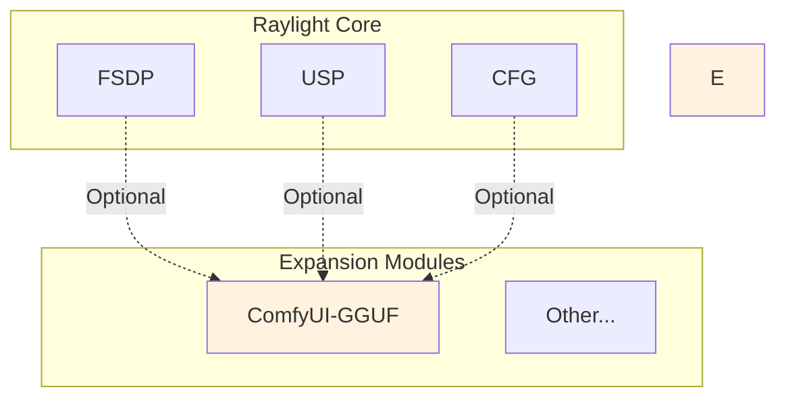
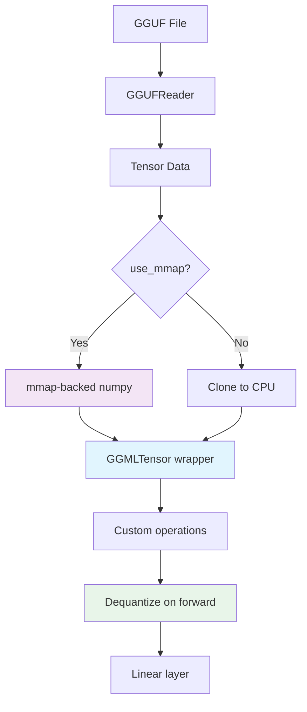
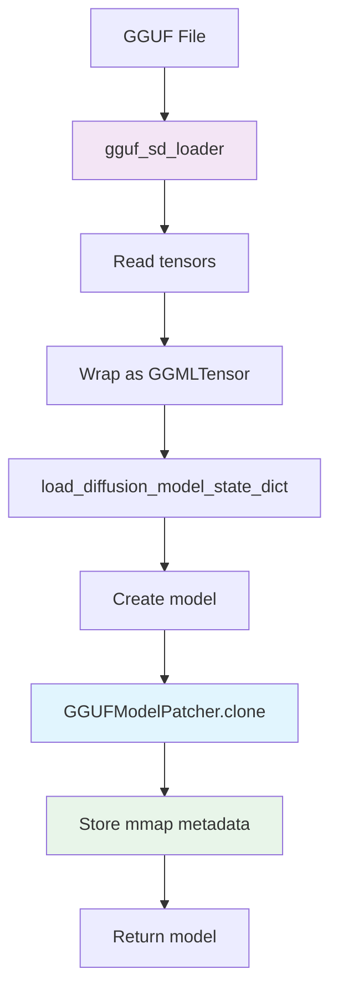
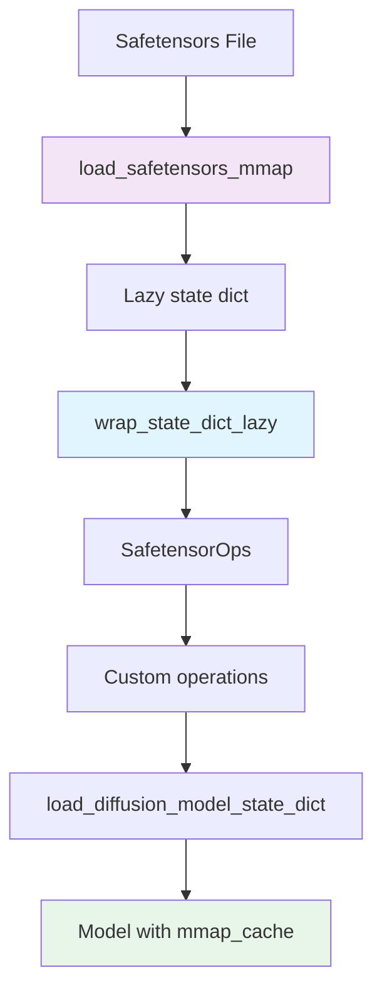

# Expansion Modules

## Overview

Raylight expansion modules are optional components that extend core Raylight functionality. They are separate from the core to allow independent development and testing.

## Expansion Types



## Expansion Module Categories

### 1. Third-Party Node Absorption

These are external node implementations that have been "absorbed" into Raylight so the Ray cluster can read and execute them.

**Characteristics**:
- Originally standalone ComfyUI custom nodes
- Modified to work with Ray actors
- Integrated into Raylight's distributed execution
- Provide specialized functionality

**Examples**:
- **ComfyUI-GGUF**: GGUF quantized model support

### 2. Comfy Extra Adaptations

These are adaptations of ComfyUI's official extra nodes for Raylight.

**Characteristics**:
- From ComfyUI's official extra nodes
- Modified for Ray execution
- Provide standard Comfy functionality in distributed context

**Examples**:
- Model custom conditioning
- Custom sampler
- Utility nodes

## ComfyUI-GGUF

### Overview

**Location**: `expansion/comfyui_gguf/`

GGUF (Generic Unified Format) support for quantized diffusion models. Enables loading of GGUF-quantized models with memory-mapped loading.

### Key Features

- **Memory-mapped loading**: Load models without full VRAM allocation
- **Quantization support**: GGML quantized tensors (IQ2_XS, Q4_0, etc.)
- **On-the-fly dequantization**: Dequantize weights during forward pass
- **Mmap restore**: Preserve mmap-backed tensors across detach cycles

### Architecture



### Files

```
expansion/comfyui_gguf/
├── loader.py          # GGUF state dict loader
├── ops.py             # GGMLTensor and custom operations
├── dequant.py         # Dequantization utilities
├── nodes.py           # ComfyUI nodes (GGUFModelPatcher, RayGGUFLoader)
└── tools/             # Conversion utilities
```

### Usage

```python
# In ComfyUI workflow
{
    "class_type": "RayGGUFLoader",
    "inputs": {
        "unet_name": "flux1-dev.gguf",
        "dequant_dtype": "default",
        "patch_dtype": "default",
        "ray_actors_init": "RAY_ACTORS_INIT",
        "lora": null
    }
}
```

### Configuration

```python
# parallel_dict
parallel_dict = {
    "is_fsdp": False,        # GGUF FSDP not supported
    "use_mmap": True,        # Enable mmap loading
}
```

### Limitations

- **FSDP not supported**: GGUF models cannot be used with FSDP
- **No quantized LoRA**: LoRA support limited
- **Single GPU**: Currently optimized for single-node, single-GPU

### GGUF Model Loading Flow



### GGUFModelPatcher

**Location**: `expansion/comfyui_gguf/nodes.py:39-166`

Extended `ModelPatcher` with GGUF-specific functionality:

```python
class GGUFModelPatcher(comfy.model_patcher.ModelPatcher):
    patch_on_device = False
    use_mmap = True
    mmap_cache = None
    unet_path = None
    _mmap_param_backup = None
    mmap_released = False
    named_modules_to_munmap = {}
```

#### Key Methods

**`load()`**: Captures mmap-backed parameters
```python
def load(self, *args, force_patch_weights=False, **kwargs):
    if getattr(self, "use_mmap", True) and self._mmap_param_backup is None:
        # Preserve original mmap-backed GGUF params
        self._mmap_param_backup = {}
        for key, param in self.model.named_parameters():
            weight = getattr(param, "data", None)
            if is_quantized(weight):
                self._mmap_param_backup[key] = weight
```

**`unpatch_model()`**: Restores mmap-backed parameters
```python
def unpatch_model(self, device_to=None, unpatch_weights=True):
    if unpatch_weights:
        for p in self.model.parameters():
            if is_torch_compatible(p):
                continue
            patches = getattr(p, "patches", [])
            if len(patches) > 0:
                p.patches = []

        if getattr(self, "use_mmap", True) and getattr(self, "_mmap_param_backup", None):
            # Restore mmap-backed params
            super().unpatch_model(device_to=None, unpatch_weights=unpatch_weights)
            for key, weight in self._mmap_param_backup.items():
                comfy.utils.set_attr_param(self.model, key, weight)
```

### RayGGUFLoader

**Location**: `expansion/comfyui_gguf/nodes.py:170-264`

ComfyUI node for loading GGUF models in Ray cluster:

```python
class RayGGUFLoader:
    @classmethod
    def INPUT_TYPES(s):
        return {
            "required": {
                "unet_name": (folder_paths.get_filename_list("unet_gguf"),),
                "dequant_dtype": (["default", "target", "float32", "float16", "bfloat16"],),
                "patch_dtype": (["default", "target", "float32", "float16", "bfloat16"],),
                "ray_actors_init": ("RAY_ACTORS_INIT",),
            },
            "optional": {"lora": ("RAY_LORA", {"default": None})},
        }
```

## ComfyUI-LazyTensors

### Overview

**Location**: `expansion/comfyui_lazytensors/`

Lazy tensor loading for safetensors. Enables memory-mapped loading without full tensor instantiation.

### Key Features

- **Lazy loading**: Load tensors on-demand
- **Memory-mapped**: No full VRAM allocation
- **Custom operations**: SafetensorOps for lazy computation
- **Drop-in replacement**: Works with existing ComfyUI code

### Architecture



### Files

```
expansion/comfyui_lazytensors/
├── lazy_tensor.py   # Lazy tensor wrapping
├── ops.py           # SafetensorOps implementation
└── __init__.py
```

### Usage

```python
# In sd.py
from raylight.expansion.comfyui_lazytensors.lazy_tensor import wrap_state_dict_lazy
from raylight.expansion.comfyui_lazytensors.ops import SafetensorOps

def lazy_load_diffusion_model(unet_path, model_options={}):
    sd = load_safetensors_mmap(unet_path)
    lazy_sd = wrap_state_dict_lazy(sd)

    load_options = model_options.copy()
    cast_dtype = load_options.pop("dtype", None)
    load_options.setdefault("custom_operations", SafetensorOps)

    model = comfy.sd.load_diffusion_model_state_dict(lazy_sd, model_options=load_options)
    model.mmap_cache = sd  # Store mmap cache for later use
    return model
```

## Adding New Expansion Modules

### Step 1: Create Module Structure

```
expansion/
└── my_custom_module/
    ├── loader.py
    ├── ops.py
    └── nodes.py
```

### Step 2: Implement Loader

```python
# expansion/my_custom_module/loader.py
def my_loader(path, **kwargs):
    """Load model with custom logic."""
    # Your loading logic here
    return state_dict
```

### Step 3: Implement Nodes

```python
# expansion/my_custom_module/nodes.py
class MyCustomNode:
    @classmethod
    def INPUT_TYPES(s):
        return {
            "required": {
                "model_name": ("MY_MODEL_LIST",),
            },
        }

    RETURN_TYPES = ("MODEL",)
    FUNCTION = "load_model"
    CATEGORY = "MyCustom"

    def load_model(self, model_name):
        # Your loading logic
        return (model,)
```

### Step 4: Register in Raylight

Update `ray_worker.py` to handle your custom loader:

```python
def load_unet(self, unet_path, model_options):
    # ... existing code ...

    if unet_path.lower().endswith(".myext"):
        from raylight.expansion.my_custom_module.loader import my_loader
        loaded_model = my_loader(unet_path, model_options=model_options)
    else:
        # ... existing code ...
```

## Expansion Module Best Practices

### 1. Keep Core Separate

- Expansion modules should not modify core Raylight
- Use optional imports with fallbacks
- Mark unsupported features clearly

### 2. Document Limitations

```python
# Clear documentation of limitations
if self.parallel_dict["is_fsdp"] is True:
    # GGUF FSDP stays disabled for now.
    raise RuntimeError("FSDP on GGUF is not supported")
```

### 3. Provide Error Messages

```python
# Helpful error messages
if model is None:
    logging.error("ERROR UNSUPPORTED DIFFUSION MODEL {}".format(unet_path))
    raise RuntimeError("ERROR: Could not detect model type of: {}\n{}".format(
        unet_path, model_detection_error_hint(unet_path, sd)
    ))
```

### 4. Test in Isolation

- Test expansion modules independently
- Ensure they don't break core functionality
- Document known issues

## Expansion Module Maintenance

### Updating Core ComfyUI

When ComfyUI core updates:

1. Check for breaking changes in APIs
2. Update expansion module imports
3. Test all expansion modules
4. Update documentation

### Adding Comfy Extra Support

To add a Comfy Extra node to Raylight:

1. Identify the node's functionality
2. Create Ray actor wrapper
3. Add to `nodes.py`
4. Update `INPUT_TYPES` for Ray cluster
5. Test with Ray execution

## See Also

- **[1-intro.md](1-intro.md)** - Overview
- **[2-fsdp.md](2-fsdp.md)** - FSDP parallelism
- **[3-usp.md](3-usp.md)** - USP parallelism
- **[4-cfg.md](4-cfg.md)** - CFG parallelism

---

*Last updated: 2026-04-11*
