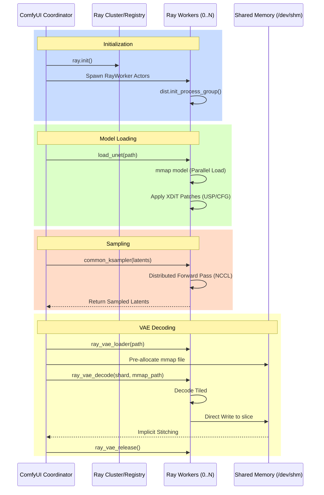

# Raylight Logic Flow: Ray Init to VAE Decode

This document walkthrough the end-to-end logic of a workflow in Raylight, from the initial setup of the distributed environment to the final decoded video output.

## 1. Ray Initialization
**Node**: `RayInitializer` or `RayInitializerAdvanced`

When the workflow hits the Ray Init node:
1.  **Cluster Connection**: The coordinator (ComfyUI main process) connects to the Ray cluster using `ray.init()`. It sets up the `runtime_env` to ensure workers have access to the `raylight` module and correct `PYTHONPATH`.
2.  **Worker Spawning**: The `make_ray_actor_fn` creates a factory to spawn `RayWorker` actors. Ray handles placing these actors on available GPUs (typically one actor per GPU).
3.  **Distributed Setup (Worker Side)**:
    *   In `RayWorker.__init__`:
        *   `torch.distributed` is initialized (NCCL for Linux, GLOO for Windows).
        *   If XDiT (`is_xdit`) is enabled, it calls `initialize_model_parallel` to set up Ulysses, Ring, and CFG degrees.
        *   Device meshes are created for FSDP or XDiT coordination.
4.  **Comm Test**: If not skipped, `ray_nccl_tester` runs a simple all-reduce to verify NCCL health across all workers.

## 2. Model Loading
**Node**: `RayUNETLoader`

1.  **Dispatch**: The coordinator triggers `load_unet` on all `RayWorker` actors.
2.  **Loading Strategies**:
    *   **Standard/GGUF**: Workers use `_load_model_generic`. This leverages `mmap` where possible, allowing multiple workers on the same physical machine to share the same model memory pages (managed by the OS).
    *   **FSDP**: Worker 0 loads the full model, others initialize "meta" models, and weights are then distributed using FSDP-native mechanisms (e.g., `fsdp_load_diffusion_model`).
3.  **Patching**:
    *   `patch_usp`: Injects Ulysses Sequence Parallel into the attention layers.
    *   `patch_cfg`: Injects parallel CFG logic if `cfg_degree > 1`.

## 3. Distributed Sampling
**Node**: `XFuserKSamplerAdvanced` (or other samplers)

1.  **Work Submission**: The coordinator divides the sampling task (if needed) and calls `common_ksampler` on the workers.
2.  **Execution**:
    *   Workers enter the `sampling_context`.
    *   **XDiT Mode**: All workers process the *same* latent batch, but they partition the sequence dimension (Ulysses) or the batch dimension (CFG/Ring) during the forward pass. NCCL handles the necessary communication (all-to-all, all-gather) inside the patched attention layers.
3.  **Return**: After sampling, workers return the resulting latent. In XDiT mode, usually Worker 0's result is taken as it's been synchronized.

## 4. Distributed VAE Decoding
**Node**: `RayVAEDecodeDistributed`

This is the most complex stage, involving a "Direct-to-Disk" optimization to avoid Ray object store bottlenecks.

1.  **VAE Loading**: `ray_vae_loader` is called on all workers to load the VAE model into RAM/VRAM.
2.  **Temporal Sharding**:
    *   The total frames are divided among workers.
    *   **Causal VAE Handling**: To ensure continuity between shards, the coordinator provides 1 frame of latent context (the preceding frame) to each shard starting after frame 0.
3.  **Shared Memory Allocation**: 
    *   The coordinator creates a shared memory file in `/dev/shm/` (RAM-based filesystem).
    *   It pre-calculates the final output shape (accounting for VAE temporal and spatial compression) and allocates the file size accordingly.
4.  **Distributed Decode & Direct Write**:
    *   Workers call `ray_vae_decode`.
    *   Inside the worker:
        *   The VAE `decode_tiled` is executed.
        *   Warmup frames (from the context provided) are discarded.
        *   The worker maps the shared `/dev/shm` file and writes its portion of decoded images directly into the correct slice ( `output_offset`).
5.  **Final Stitching**:
    *   Once all workers finish, the coordinator simply reads the `full_image` tensor which is backed by the shared mmap file.
    *   The VAE is released from workers (`ray_vae_release`) to free RAM.
    *   The temporary mmap file is unlinked.

---
### Sequence Diagram

