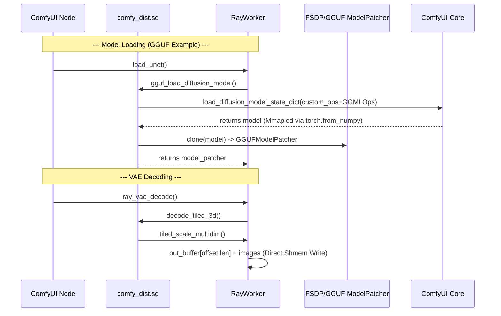

# Raylight Logic Flow: Deep Class & Method Analysis

This document provides a highly granular technical trace of Raylight's operation, specifically detailing how it extends ComfyUI's core for distributed execution.

---

## 1. Initialization Phase

### `RayInitializer` & `RayWorker`
*   **ComfyUI Node**: `RayInitializer.spawn_actor`
*   **Worker Init**: `RayWorker.__init__(local_rank, device_id, parallel_dict)`
    1.  **Process Group**: Initializes `torch.distributed` with `nccl` (Linux) or `gloo` (Windows).
    2.  **XDiT Environment**: If `is_xdit` is true, it calls `xfuser.core.distributed.initialize_model_parallel`. This partitions the world into Ulysses (sequence), Ring (attention), and CFG (classifier-free guidance) groups.
    3.  **Device Mesh**: Creates a 1D `dist.device_mesh` for FSDP or XDiT coordination.

---

## 2. Model Loading Deep Dive

### GGUF Loading Flow (`expansion/comfyui_gguf/loader.py`)
GGUF is designed for zero-copy RAM sharing between workers.

1.  **Loader Method**: `gguf_sd_loader(path, ...)`
    *   **Mmap Internals**: Uses `gguf.GGUFReader` to open the file.
    *   **Tensor Creation**: Calls `torch.from_numpy(tensor.data)`. 
        > [!IMPORTANT]
        > Because `gguf` returns a memory-mapped numpy array, `torch.from_numpy` creates a **zero-copy view**. The tensor's storage is directly linked to the file on disk.
### `sd.py` & `ray_worker.py` Orchestration
`src/raylight/comfy_dist/sd.py` and `ray_worker.py` collaborate to ensure zero-copy reloads.

1.  **Cache Isolation layer [NEW]**:
    *   **Logic**: Before passing a cached `state_dict` to the model loader, `RayWorker` executes: `isolated_sd = {k: v.clone() for k, v in cached_sd.items()}`.
    *   **Requirement**: This requires a functioning `clone()` on `GGMLTensor`.
2.  **`GGMLTensor` Fix (`ops.py`)**:
    *   **Issue**: Original `ops.py` had `clone()` and `detach()` returning `self`. This caused any model "backup" or "cloned" state-dict entry to point to the same object as the live weight. When the live weight moved to GPU, the "cache" moved with it.
    *   **Fix**: Restored `super().clone()` and `super().detach()` with proper metadata propagation (`tensor_type`, `tensor_shape`).
3.  **VRAM Force**: Calls `model.load(self.device)`. This triggers the actual dequantization of weights from the `mmap` RAM into the GPU VRAM.
4.  **Zero-Copy Offload**: `GGUFModelPatcher.unpatch_model` performs a pointer swap back to the **cloned** (and thus still on CPU) mmap handles in `self.mmap_cache`.
`src/raylight/comfy_dist/sd.py` acts as a distributed wrapper for ComfyUI's core model loading.

*   **`fsdp_load_diffusion_model_stat_dict`**:
    1.  **Prefix Handling**: Extracts `diffusion_model` prefix (e.g., `model.`) and cleans the state dict.
    2.  **Precision Detection**: Calls `model_management.unet_dtype` to decide if the model should be FP16, BF16, or FP8.
    3.  **FSDP Wrapping**: Wraps the resulting model in `FSDPModelPatcher`.
    4.  **Meta Conversion**: After wrapping, it calls `model.to("meta")`. This is crucial: it clears the "template" weights from CPU RAM, as FSDP handles the real weight sharding internally.

---

## 3. Sampling Logic

### `RayWorker.common_ksampler`
*   **Context**: `sampling_context` ensures that `work_model.load_device` matches the worker's assigned GPU.
*   **Execution**: Calls standard `comfy.sample.sample`.
*   **Distributed Layer Interaction**:
    *   Inside the model's forward pass, layers patched by `USPInjectRegistry` (Ulysses Sequence Parallelism) perform `all_to_all` communications.
    *   This splits the `L` (sequence length) dimension across GPUs for the attention calculation and then re-joins it.

---

## 4. VAE Decoding & Stitching

### `decode_tiled_3d` Logic (`comfy_dist/sd.py` & `utils.py`)
This is how Raylight splits video frames across workers without edge artifacts.

1.  **Tiled Scaling**: Calls `tiled_scale_multidim`.
2.  **Feathering & Normalization**:
    *   **Feathering**: A linear alpha mask is applied to the edges of each tile.
    *   **Accumulation**: Decoded pixels are added to an `out` buffer.
    *   **Normalization**: An `out_div` buffer tracks the sum of mask weights. The final output is `out / out_div`, which blends overlapping tiles perfectly.
3.  **Direct-to-Disk (Mmap)**:
    *   `torch.from_file(mmap_path, shared=True)` is the core mechanism.
    *   It creates a **shared memory mapping** across Linux processes via `/dev/shm`.
    *   When Worker 1 writes to its slice of the tensor, the Coordinator's view of that same tensor is updated instantly with **zero** network overhead.

---

## Sequence Summary of Class Calls

